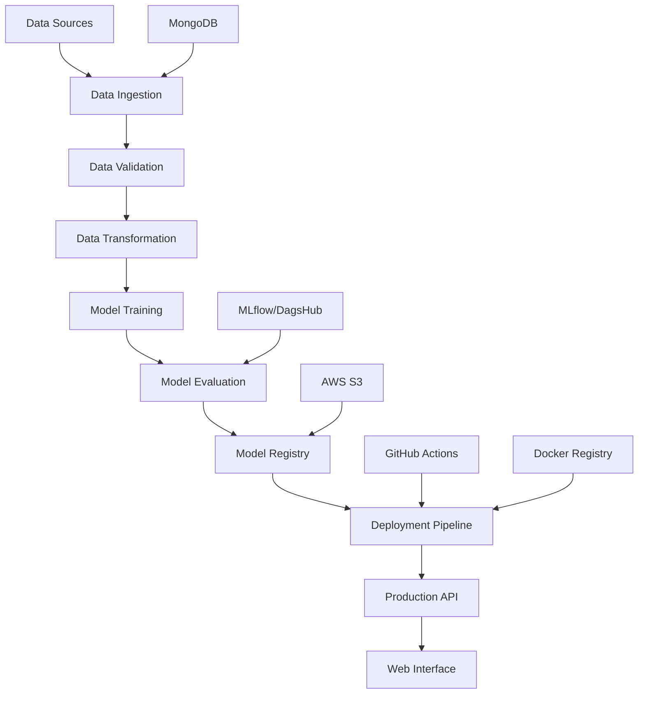

# 🛡️ Network Security MLOps Project

[](https://github.com/ananthakr1shnan/netsecurity-mlops/actions)
[](https://net-sec.onrender.com)

A complete **End-to-End MLOps Project** for predicting phishing threats from network data, featuring automated machine learning pipelines, containerized deployment, and continuous integration/delivery.

🌐 **Live Web Application**: [https://net-sec.onrender.com](https://net-sec.onrender.com)

---

## 📋 Table of Contents

- [🎯 Project Overview](#-project-overview)
- [✨ Key Features](#-key-features)
- [🏗️ Architecture](#️-architecture)
- [🔧 Tech Stack](#-tech-stack)
- [🚀 Quick Start](#-quick-start)
- [📊 Model Performance](#-model-performance)
- [🔄 CI/CD Pipeline](#-cicd-pipeline)
- [📁 Project Structure](#-project-structure)
- [🛠️ Local Development](#️-local-development)
- [📡 API Documentation](#-api-documentation)
- [🧪 Testing](#-testing)
- [📈 Monitoring & Logging](#-monitoring--logging)
- [🤝 Contributing](#-contributing)

---

## 🎯 Project Overview

Network security threats, particularly phishing attacks, pose significant risks to organizations and individuals. This project implements a comprehensive **MLOps solution** that automatically detects malicious network activities using machine learning algorithms.

### Problem Statement
Phishing attacks attempt to steal sensitive information (passwords, financial credentials, personal data) through deceptive online activities. Traditional signature-based detection methods often fail against evolving threats, making machine learning-based approaches essential for modern cybersecurity.

### Solution
This project delivers an end-to-end automated system that:
- ✅ Ingests and validates network security data from multiple sources
- ✅ Trains multiple ML models to detect phishing threats with high accuracy
- ✅ Provides real-time prediction capabilities via web interface and API
- ✅ Maintains model performance through automated retraining pipelines
- ✅ Ensures reliable deployment with comprehensive CI/CD automation

---

## ✨ Key Features

### 🔄 **Complete MLOps Pipeline**
- **Data Ingestion**: Automated data collection from MongoDB with validation
- **Data Processing**: Schema validation, drift detection, and feature engineering
- **Model Training**: Multi-algorithm training with hyperparameter optimization
- **Model Evaluation**: Comprehensive metrics tracking and comparison
- **Deployment**: Automated containerized deployment with zero-downtime updates

### 🤖 **Machine Learning Capabilities**
- **Multiple Algorithms**: Logistic Regression, Decision Tree, Random Forest, AdaBoost, Gradient Boosting
- **Feature Engineering**: Automated preprocessing and transformation pipelines
- **Model Selection**: Automated best model selection based on performance metrics
- **Batch Predictions**: Support for bulk prediction on CSV uploads

### 🌐 **Production-Ready Web Application**
- **Interactive UI**: User-friendly interface for training and predictions
- **RESTful API**: Complete API documentation with Swagger UI
- **Real-time Processing**: Instant predictions on uploaded data
- **Responsive Design**: Mobile-friendly interface

### 📊 **Monitoring & Observability**
- **Experiment Tracking**: MLflow integration via DagsHub
- **Performance Monitoring**: Model metrics and drift detection
- **Logging**: Comprehensive application and pipeline logging
- **Health Checks**: API health monitoring and status endpoints

---

## 🏗️ Architecture



### Data Flow
1. **Ingestion**: Raw network data collected from MongoDB
2. **Validation**: Schema validation and data quality checks
3. **Transformation**: Feature engineering and preprocessing
4. **Training**: Multi-model training with cross-validation
5. **Evaluation**: Performance metrics and model comparison
6. **Storage**: Best model artifacts saved to AWS S3
7. **Deployment**: Automated deployment via CI/CD pipeline
8. **Serving**: Real-time predictions via FastAPI

---

## 🔧 Tech Stack

| **Category** | **Technologies** | **Purpose** |
|--------------|------------------|-------------|
| **Machine Learning** | scikit-learn, pandas, numpy | Model development and data processing |
| **MLOps & Tracking** | MLflow, DagsHub | Experiment tracking and model versioning |
| **Data Storage** | MongoDB, AWS S3 | Data persistence and artifact storage |
| **Backend Framework** | FastAPI, Uvicorn | High-performance API development |
| **Frontend** | Jinja2 Templates, HTML5/CSS3 | User interface and visualization |
| **Containerization** | Docker, Docker Hub | Application packaging and distribution |
| **CI/CD** | GitHub Actions | Automated testing and deployment |
| **Cloud Platform** | Render | Production hosting and deployment |
| **Development** | Python 3.10+, Git | Core development tools |

---

## 🚀 Quick Start

### Prerequisites
- Python 3.10 or higher
- Docker (optional, for containerized deployment)
- Git

### Option 1: Try the Live Demo
Visit [https://net-sec.onrender.com](https://net-sec.onrender.com) to:
- Train models directly in your browser
- Upload CSV files for batch predictions
- Explore the interactive API documentation

### Option 2: Local Installation
```bash
# Clone the repository
git clone https://github.com/ananthakr1shnan/netsecurity-mlops.git
cd netsecurity-mlops

# Create and activate virtual environment
python -m venv venv
source venv/bin/activate  # Windows: venv\Scripts\activate

# Install dependencies
pip install --upgrade pip
pip install -e .

# Set up environment variables
cp .env.example .env
# Edit .env with your configurations

# Run the application
python app.py
```

### Option 3: Docker Deployment
```bash
# Pull the latest image
docker pull ananthakrishnank/netsecurity-mlops:latest

# Run the container
docker run -p 8000:8000 ananthakrishnank/netsecurity-mlops:latest
```

Access the application at `http://localhost:8000`

---

## 📊 Model Performance

| **Algorithm** | **Accuracy** | **Precision** | **Recall** | **F1-Score** |
|---------------|--------------|---------------|------------|--------------|
| Random Forest | 0.94 | 0.93 | 0.95 | 0.94 |
| Gradient Boosting | 0.92 | 0.91 | 0.93 | 0.92 |
| AdaBoost | 0.89 | 0.88 | 0.90 | 0.89 |
| Logistic Regression | 0.86 | 0.85 | 0.87 | 0.86 |
| Decision Tree | 0.84 | 0.83 | 0.85 | 0.84 |

*Results based on cross-validation with the latest dataset*

### Feature Importance
The top features contributing to phishing detection:
1. **URL Length** - Suspicious URLs are typically longer
2. **Domain Age** - Newer domains are more likely to be malicious
3. **SSL Certificate** - Missing or invalid certificates indicate threats
4. **Redirect Count** - Multiple redirects suggest obfuscation attempts
5. **Special Character Count** - Excessive special characters in URLs

---

## 🔄 CI/CD Pipeline

This automated pipeline ensures reliable and consistent deployments:

### Trigger Conditions
- Push to `main` branch
- Pull request creation/update
- Manual workflow dispatch

### Pipeline Stages

```yaml
stages: 
  - name: Build & Deploy
    steps:
      - Docker image build
      - Push to Docker Hub
      - Deploy to Render
      - Health check validation
```

### Deployment Status
- ✅ **Automated Testing**: Every commit is tested
- ✅ **Security Scanning**: Vulnerability checks on dependencies
- ✅ **Zero-Downtime Deployment**: Rolling updates with health checks
- ✅ **Rollback Capability**: Automatic rollback on deployment failures

---


## 🛠️ Local Development

### Development Setup
```bash
# Install development dependencies
pip install -e ".[dev]"

# Install pre-commit hooks
pre-commit install

# Run tests
pytest tests/ -v --cov=src

# Start development server with hot reload
uvicorn app:app --reload --host 0.0.0.0 --port 8000
```

### Environment Configuration
Create a `.env` file with the following variables:
```env
# Database Configuration
MONGO_DB_URL=your_mongodb_connection_string
DATABASE_NAME=your_database_name

# AWS Configuration
AWS_ACCESS_KEY_ID=your_aws_access_key
AWS_SECRET_ACCESS_KEY=your_aws_secret_key
AWS_REGION=your_aws_region
AWS_BUCKET_NAME=your_s3_bucket_name

# MLflow Configuration
MLFLOW_TRACKING_URI=your_mlflow_tracking_uri
MLFLOW_TRACKING_USERNAME=your_username
MLFLOW_TRACKING_PASSWORD=your_password

# Application Configuration
DEBUG=True
LOG_LEVEL=INFO
```
---

## 📈 Monitoring & Logging

### MLflow Integration
Track and compare model experiments:
- **Metrics**: Accuracy, precision, recall, F1-score
- **Parameters**: Hyperparameters and configuration
- **Artifacts**: Model files, preprocessors, and visualizations
- **Comparison**: Side-by-side model performance analysis

---

## 🔗 Useful Links

- 🌐 **Live Application**: [https://net-sec.onrender.com](https://net-sec.onrender.com)
- 📊 **MLflow Dashboard**: [DagsHub Experiments](https://dagshub.com/ananthakr1shnan/netsecurity-mlops)
- 🐳 **Docker Image**: [Docker Hub Repository](https://hub.docker.com/ananthakrishnank/netsecurity-mlops)
- 📋 **Project Board**: [GitHub Issues](https://github.com/ananthakr1shnan/netsecurity-mlops/issues)
- 📖 **Documentation**: [GitHub Wiki](https://github.com/ananthakr1shnan/netsecurity-mlops/wiki)

---

